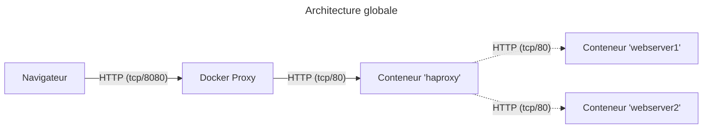

# Exercice 2 - Option "locale"



## Démarrer

1. Avec un terminal, se positionner dans le répertoire `exo-2/docker`
2. Exécuter la commande suivante:

   ```bash
    docker compose up
   ```

3. Le fichier de configuration HAProxy est accessible avec le chemin `exo-2/docker/haproxy.conf`. Une fois les modifications apportées à la configuration de celui-ci, il devrait être accessible à l'adresse http://localhost:8080.

## Commandes utiles

### Nettoyer son environnement après l'exercice

```bash
docker compose down -v --remove-orphans
```

### Redémarrer le conteneur haproxy pour prendre en compte les modifications de la configuration

```bash
docker compose restart haproxy
```

### Visualiser les logs du service HAProxy

```bash
docker compose logs -f haproxy
```
